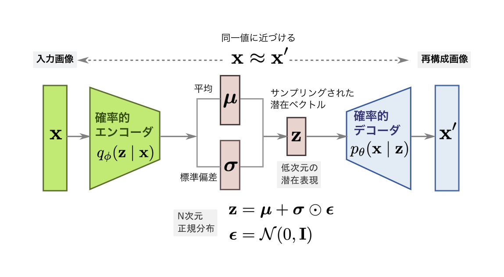
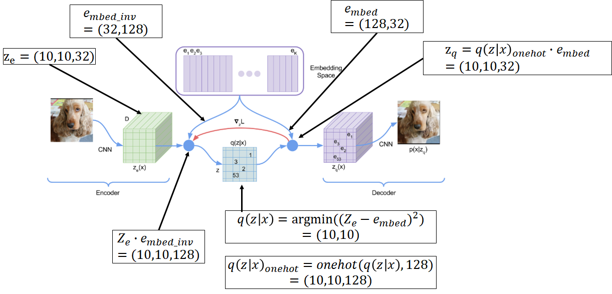
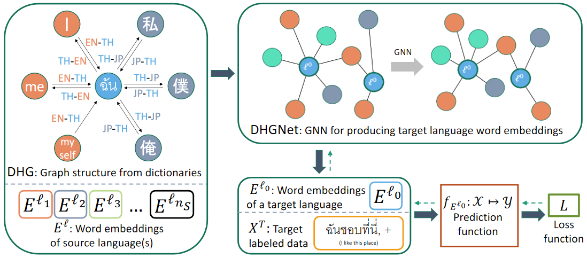
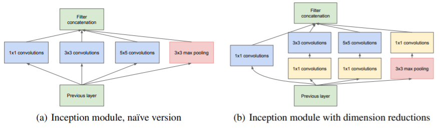
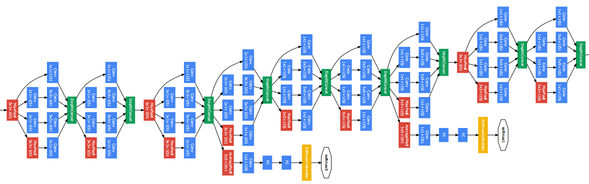
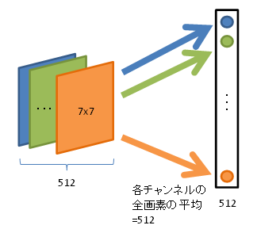
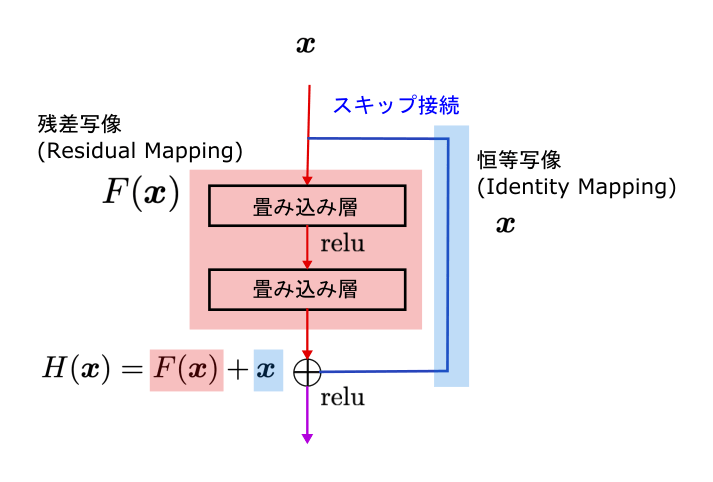
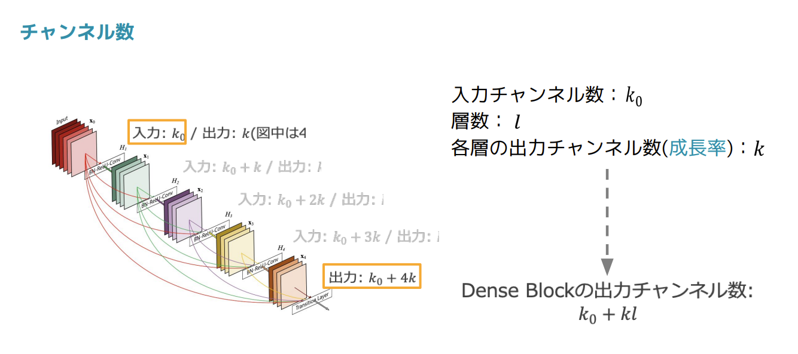

# E資格対策

---
20230219受験後メモ
- プログラミングの問題はあまり出ない（機械学習はなし）が、今後の実務上tensolflowを使いこなせる必要がある
- 実務視点の問題が多かった（ハイパーパラメータ関係）
- 「モデルの表現」「アノテーション」というキーワードが多かった
- GPT-nは要勉強（OpenAIというキーワードが出ていた）
- scale lawの理解が必要
- 現在のトレンド
  - 深層強化学習
  - 音声認識
  - 文書生成
  - 深層分散処理
  - GAN
---

# 目次

- [E資格対策](#e資格対策)
- [目次](#目次)
  - [1 応用数学](#1-応用数学)
    - [(1) 確率・統計](#1-確率統計)
      - [①一般的な確率分布](#一般的な確率分布)
        - [ベルヌーイ分布](#ベルヌーイ分布)
        - [多項分布](#多項分布)
        - [ガウス分布](#ガウス分布)
      - [②ベイズ則(導出方法は？)ビショップ本](#ベイズ則導出方法はビショップ本)
    - [(2) 情報理論](#2-情報理論)
      - [①情報理論](#情報理論)
        - [情報量](#情報量)
  - [2 機械学習](#2-機械学習)
    - [(1) 機械学習の基礎](#1-機械学習の基礎)
      - [①学習アルゴリズム](#学習アルゴリズム)
        - [教師あり学習](#教師あり学習)
      - [01 線形回帰](#01-線形回帰)
      - [02 正則化](#02-正則化)
      - [03 ロジスティック回帰](#03-ロジスティック回帰)
      - [04 サポートベクトルマシンLinear Support Vector Machine](#04-サポートベクトルマシンlinear-support-vector-machine)
      - [05 サポートベクトルマシン(カーネル法)](#05-サポートベクトルマシンカーネル法)
      - [06 ナイーブベイズ](#06-ナイーブベイズ)
      - [07 ランダムフォレスト](#07-ランダムフォレスト)
      - [08 ニューラルネットワーク](#08-ニューラルネットワーク)
      - [09 kNN k近傍法](#09-knn-k近傍法)
        - [教師なし学習](#教師なし学習)
      - [10 PCA](#10-pca)
      - [11 LSA](#11-lsa)
      - [12 NMF(Non-negative Matrix Factorization)](#12-nmfnon-negative-matrix-factorization)
      - [13 LDA(Latent Dirichlet allocation)](#13-ldalatent-dirichlet-allocation)
      - [14 k-means法](#14-k-means法)
      - [15 混合ガウス分布](#15-混合ガウス分布)
      - [16 LLE(Local Linear Embedding)](#16-llelocal-linear-embedding)
      - [17 t-SNE(t-Distributed Stochastic Neighbor Embedding)](#17-t-snet-distributed-stochastic-neighbor-embedding)
        - [半教師あり学習](#半教師あり学習)
        - [転移学習](#転移学習)
      - [②機械学習課題](#機械学習課題)
        - [能力、過剰適合、過小適合](#能力過剰適合過小適合)
        - [次元の呪い「１問一等」](#次元の呪い１問一等)
      - [③ハイパーパラメータ](#ハイパーパラメータ)
      - [④検証集合](#検証集合)
        - [学習データ、検証データ、テストデータ「ハイパーパラメータとして更新されるとき使うのは？」](#学習データ検証データテストデータハイパーパラメータとして更新されるとき使うのは)
        - [ホールドアウト法](#ホールドアウト法)
        - [k-分割交差検証法](#k-分割交差検証法)
      - [⑤最尤推定](#最尤推定)
        - [条件付き対数尤度と平均二乗和誤差「logの式が出た」](#条件付き対数尤度と平均二乗和誤差logの式が出た)
    - [(2) 実用的な方法論](#2-実用的な方法論)
      - [①性能指標](#性能指標)
        - [分類問題「計算が３問、擬陽性とか」](#分類問題計算が３問擬陽性とか)
      - [②ハイパーパラメータの選択](#ハイパーパラメータの選択)
        - [手動でのハイパーパラメータ調整](#手動でのハイパーパラメータ調整)
        - [グリッドサーチ](#グリッドサーチ)
        - [ランダムサーチ](#ランダムサーチ)
        - [モデルに基づくハイパーパラメータの最適化](#モデルに基づくハイパーパラメータの最適化)
    - [(3) 強化学習](#3-強化学習)
      - [①方策勾配法「REINFORCE数式、sarsa,」](#方策勾配法reinforce数式sarsa)
      - [②価値反復法](#価値反復法)
  - [3 深層学習](#3-深層学習)
    - [(1) 順伝搬型ネットワーク](#1-順伝搬型ネットワーク)
      - [全結合型ニューラルネットワーク](#全結合型ニューラルネットワーク)
      - [損失関数](#損失関数)
        - [最尤推定による条件付き分布の学習](#最尤推定による条件付き分布の学習)
      - [活性化関数](#活性化関数)
        - [シグモイド関数](#シグモイド関数)
        - [softmax関数](#softmax関数)
        - [ReLU、Leaky ReLU](#reluleaky-relu)
        - [tanh](#tanh)
      - [誤差逆伝播法及びその他の微分アルゴリズム](#誤差逆伝播法及びその他の微分アルゴリズム)
        - [計算グラフ](#計算グラフ)
        - [微積分の連鎖率](#微積分の連鎖率)
        - [誤差逆伝播のための連鎖率の再起的な適用](#誤差逆伝播のための連鎖率の再起的な適用)
        - [シンボル間の微分](#シンボル間の微分)
        - [一般的な誤差逆伝播法](#一般的な誤差逆伝播法)
    - [(2) 深層モデルのための正則化](#2-深層モデルのための正則化)
      - [パラメータノルムペナルティー](#パラメータノルムペナルティー)
        - [L2パラメータ正則化](#l2パラメータ正則化)
        - [L1正則化](#l1正則化)
      - [データ集合の拡張「数字？」](#データ集合の拡張数字)
        - [Random Flip・Erase・Crop・Contrast・Brightness・Rotate、MixUp](#random-fliperasecropcontrastbrightnessrotatemixup)
      - [ノイズに対する頑健性「間接的に出題されたような。。。」](#ノイズに対する頑健性間接的に出題されたような)
        - [出力目標へのノイズ注入](#出力目標へのノイズ注入)
      - [マルチタスク学習](#マルチタスク学習)
      - [早期終了](#早期終了)
      - [スパース表現](#スパース表現)
      - [バギングやその他のアンサンブル手法](#バギングやその他のアンサンブル手法)
      - [ドロップアウト](#ドロップアウト)
    - [(3) 深層モデルのための最適化](#3-深層モデルのための最適化)
      - [学習と純粋な最適化の差異](#学習と純粋な最適化の差異)
        - [バッチアルゴリズムとミニバッチアルゴリズム](#バッチアルゴリズムとミニバッチアルゴリズム)
      - [基本的なアルゴリズム](#基本的なアルゴリズム)
        - [確率的勾配降下法](#確率的勾配降下法)
        - [モメンタム](#モメンタム)
      - [パラメータの初期化戦略](#パラメータの初期化戦略)
      - [適応的な学習率をもつアルゴリズム](#適応的な学習率をもつアルゴリズム)
        - [AdaGrad](#adagrad)
        - [RMSProp](#rmsprop)
        - [Adam](#adam)
      - [最適化戦略とメタアルゴリズム](#最適化戦略とメタアルゴリズム)
        - [バッチ正規化](#バッチ正規化)
        - [Layer正規化](#layer正規化)
        - [Instance正規化](#instance正規化)
        - [教師あり事前学習(Pretraining)](#教師あり事前学習pretraining)
    - [(4) 畳み込みネットワーク](#4-畳み込みネットワーク)
      - [畳込み処理「間接的に出題された」](#畳込み処理間接的に出題された)
      - [プーリング](#プーリング)
    - [(5) 回帰結合型ニューラルネットワークと再帰的ネットワーク](#5-回帰結合型ニューラルネットワークと再帰的ネットワーク)
      - [回帰結合型のニューラルネットワーク](#回帰結合型のニューラルネットワーク)
      - [双方向RNN「BERTの問題で図を選ばせる問題が出た」](#双方向rnnbertの問題で図を選ばせる問題が出た)
      - [Encoder-decoderと　Sequence-to-Sequence](#encoder-decoderとsequence-to-sequence)
      - [長期依存性の課題](#長期依存性の課題)
      - [ゲート付きRNN](#ゲート付きrnn)
        - [LSTM「直接的ではないがBERTの問題で間接的に出題された」](#lstm直接的ではないがbertの問題で間接的に出題された)
        - [GRU](#gru)
      - [長期依存性の最適化](#長期依存性の最適化)
        - [勾配クリッピング](#勾配クリッピング)
      - [Attention「数式、説明が出た」](#attention数式説明が出た)
    - [(6) 生成モデル](#6-生成モデル)
      - [識別モデルと生成モデル「数式が出た」](#識別モデルと生成モデル数式が出た)
      - [オートエンコーダ](#オートエンコーダ)
      - [VAE(Variational Autoencoder)](#vaevariational-autoencoder)
        - [VQ-VAE(Vector Quantised Variational Autoencoder)](#vq-vaevector-quantised-variational-autoencoder)
      - [GAN「programming問題、最終的には0.5?1？に近づけたい？」](#ganprogramming問題最終的には051に近づけたい)
        - [DCGAN](#dcgan)
        - [Conditional GAN](#conditional-gan)
    - [(7) 深層強化学習](#7-深層強化学習)
      - [①深層強化学習のモデル](#深層強化学習のモデル)
        - [AlphaGo](#alphago)
        - [A3C「数式の解釈」](#a3c数式の解釈)
    - [(8) グラフニューラルネットワーク](#8-グラフニューラルネットワーク)
      - [グラフ畳み込み](#グラフ畳み込み)
    - [(9) 深層学習の適応方法](#9-深層学習の適応方法)
      - [画像認識](#画像認識)
        - [GoogLeNet](#googlenet)
        - [Resnet、WideResNet「間接的に出題されていた」](#resnetwideresnet間接的に出題されていた)
        - [DenseNet「間接的に出ていた、あとVGGも」](#densenet間接的に出ていたあとvggも)
        - [EfficientNet](#efficientnet)
      - [画像の局在化・検知・セグメンテーション](#画像の局在化検知セグメンテーション)
      - [FasterR-CNN](#fasterr-cnn)
        - [YOLO「簡単な計算問題が出た」](#yolo簡単な計算問題が出た)
        - [SSD](#ssd)
        - [MaskR-CNN](#maskr-cnn)
        - [FCOS「説明文が出ていた」](#fcos説明文が出ていた)
      - [自然言語処理](#自然言語処理)
        - [WordEmbedding](#wordembedding)
        - [Transformer「重箱の隅をつく問題が4問くらい出た、BERT、GPTとの違い」](#transformer重箱の隅をつく問題が4問くらい出たbertgptとの違い)
        - [BERT「TransformerとGPT-nとの比較で出ていた」](#berttransformerとgpt-nとの比較で出ていた)
        - [GPT-n「がっつり出題されたXAI」](#gpt-nがっつり出題されたxai)
      - [音声処理](#音声処理)
        - [WaveNet「数式と図を選ばせる問題」](#wavenet数式と図を選ばせる問題)
        - [高速フーリエ変換「間接的に単語が出ていた」](#高速フーリエ変換間接的に単語が出ていた)
        - [メル尺度](#メル尺度)
        - [CTC(Connectionist Temporal Classification)](#ctcconnectionist-temporal-classification)
      - [スタイル変換](#スタイル変換)
        - [pix2pix「説明文が出ていた、Ｕ－ＮＥｔも図が出ていた」](#pix2pix説明文が出ていたｕｎｅｔも図が出ていた)
    - [(10) 距離学習(Metric Learning)](#10-距離学習metric-learning)
    - [(11) メタ学習(Meta Learning)](#11-メタ学習meta-learning)
      - [初期値の獲得](#初期値の獲得)
        - [MAML(Model-Agnostic Meta-Learning)](#mamlmodel-agnostic-meta-learning)
    - [(12) 深層学習の説明性](#12-深層学習の説明性)
      - [判断根拠の可視化](#判断根拠の可視化)
        - [Grad-CAM「プログラミング、depences~、猫の絵」](#grad-camプログラミングdepences猫の絵)
      - [モデルの近似](#モデルの近似)
        - [LIME(Local Interpretable Model-agnostic Explanations)](#limelocal-interpretable-model-agnostic-explanations)
        - [SHAP](#shap)
  - [4 開発・運用環境](#4-開発運用環境)
    - [(1) ミドルウェア](#1-ミドルウェア)
      - [①深層学習ライブラリ](#深層学習ライブラリ)
    - [(2) エッジコンピューティング](#2-エッジコンピューティング)
      - [①軽量なモデル「MobileNet関連で出た」](#軽量なモデルmobilenet関連で出た)
        - [MobileNet](#mobilenet)
      - [②モデルの軽量化](#モデルの軽量化)
        - [プルーニング](#プルーニング)
        - [蒸留「数式、実用面での注意事項等深く出題された」](#蒸留数式実用面での注意事項等深く出題された)
        - [量子化](#量子化)
    - [(3) 分散処理「論文（ワーカとパラメータサーバー管理」](#3-分散処理論文ワーカとパラメータサーバー管理)
      - [①モデル並列化](#モデル並列化)
      - [②データ並列化](#データ並列化)
    - [(4) アクセラレータ](#4-アクセラレータ)
      - [①デバイスによる高速化](#デバイスによる高速化)
        - [GPU「GPUの性能、TPU（レイテンシ、ノイマン～）についても説明問題が出た」](#gpugpuの性能tpuレイテンシノイマンについても説明問題が出た)
    - [(5) 環境構築](#5-環境構築)
      - [①コンテナ型仮想化](#コンテナ型仮想化)
        - [Docker](#docker)
      - [勉強参考サイト](#勉強参考サイト)


## 1 応用数学

### (1) 確率・統計

確率：事象の起こりやすさを定量的に示すもの

- 確率基礎
  - 確率変数
    - 確率的な量のこと
    - Ω上のただの関数
    - どの世界でどんな値が出るか特定していた
  - 確率分布
    - 大雑把に面積だけを意識したもの
    - 確率分布だけ与えられても確率変数は定まらない
      - 離散値
      - 連続値
  - 同時確率
    - 確率変数X,Yに対し、X=aかつY=bとなる確率をP(X=a,Y=b)とすると複数の条件を指定してそれらがすべて同時に成り立つ確率のこと
  - 周辺確率
    - P(X=a),P(Y=b)のような単独の確率は周辺確率
  - 条件付き確率
    - 実用上興味のある量
    - P(X|Y)：X=赤という条件の下でのY=数札の条件付確率は1/3

#### ①一般的な確率分布

##### <span style="color: red; ">ベルヌーイ分布

```math
P(x)=p^x(1-p)^{1-x}
```

##### 多項分布

##### <span style="color: red; ">ガウス分布

```math
f(x) = \frac{1}{\sqrt{2\pi\sigma}}\exp{\left\{-\frac{(x-\mu)^2}{2\sigma^2}\right\}}
```

#### <span style="color: red; ">②ベイズ則(導出方法は？)ビショップ本

  - "標本"を必ずしも必要とはしない、時間を逆転させている。
  - 結果から原因を求める
    - 機械学習での使用例：
      - モデルの比較
  - 音声データから話した言葉を充てる
  - 画像データから書いてある文字をあてる
  - 事前確率
  - 事後確率
- 自乗期待値と分散
  (Xとaとの自乗誤差の期待値) = (期待値の自乗誤差) + (分散)  
                           = (偏りによる誤差) + (ばらつきによる誤差)  
  - Q.期待値と分散の関係性は？
- Q.確率密度関数とは？
- 大数の法則
  揺らぐ値でもたくさん集めて平均すれば揺らぎがなくなる
- 平均値の期待値・平均値の分散
- 中心極限定理
- Q.等分散正規分布の最尤推定と二乗和誤差の最小値問題の関連性は？
  →負の対数尤度は機械学習でいうところの２クラス分類のニューラルネットワークの学習に適応されることの多い損失関数の形（2クラス分類の 
   場合の交差エントロピー）に他ならない。
  →最尤推定量とは「尤度関数が最大にるように決められる確率分布がデータに最もよくあてはまるようなパラメータ推定量のことをいう」

- 決定理論
  確率論と組み合わせることでパターン認識で遭遇する、不確からしさを含む状況における最適な意思決定を行うことを可能にする 
  同時確率分布はこれらの変数に関する不可実性を完全に要約するものである

- 推論と決定
  - 推論段階
  - 決定段階

### (2) 情報理論

#### ①情報理論

##### 情報量

- 情報理論とは情報を伝送するための理論的な基盤を記述した学問
- びっくり度が情報の大きさ→確率が低いほど大きな値になるような指標で表したい
- 自己情報量

```math
I(X) = -\log_{2}P(X)
```

- シャノンエントロピー

```math
H(X) = \mathbb{E}[I(X)]=- \sum_{x\in \Omega} P(X=x)\log_{2}P(X=x)
```

- 相互情報量
  - XとYがどれくらい独立でないかを表す
  - 片方の確率変数が判明した場合どの程度エントロピーが減少するかを表す指標
  - ２つの確率変数の相互依存度を表す量
  - MI (X,Y) ＝０の時、XとYが独立
  - Xの分布を固定した場合Yの分布がXの分布と同じである場合M (X,Y）は最大値を取る
  - エントロピーまたはシャノン情報量
  - 期待値

- <span style="color: red; ">KLダイバージェンス＋GANの誤差関数

ダイバージェンスは二つの確率分布の離れ度合い（分離度）を測る尺度で、距離ではない
特に、KL（カルバック・ライブラー）-ダイバージェンス（KL情報量）とは、真の確率分布に対するモデルの確率分布の分離度を測る尺度
機械学習において、変分Auto-Encoder（VAE）などの誤差関数として利用

また、KL-ダイバージェンスとクロスエントロピーの間には、式(5)の関係

```math
D_{\mathrm{KL}}(p||q) = H(p,q) - H(p)
```

下記のように式(5)は示すことができます。

```math
\begin{align}
D_{\mathrm{KL}}(p||q) =& \sum_{x\in \Omega} p(x)\log_{2}\frac{p(x)}{q(x)}\\
 =& \sum_{x\in \Omega} p(x)(\log_{2}p(x)-\log_{2}q(x))\\
 =& \sum_{x\in \Omega} p(x)\log_{2}p(x)-\sum_{x\in \Omega} p(x)\log_{2}q(x)\\
 =& - \left(-\sum_{x\in \Omega} p(x)\log_{2}p(x)\right) -\sum_{x\in \Omega} p(x)\log_{2}q(x)\\
 =& - H(p) + H(p,q)
\end{align}
```

```math
D_{KL}(P||Q)=\sum_{x}P(x)(-log(Q(x))-(-log(P(x))=\sum_{x}P(x)log(P(x)/Q(x))
```

- JSダイバージェンス
真の確率分布に対するモデルの確率分布の分離度を測る尺度
ただし、$R(x) = (P(x) + Q(x))/2$

なお、$p,q$について対称で、交換可能です。

```math
D_{\mathrm{JS}}(P||Q) = \frac{1}{2}(D_{\mathrm{KL}}(P||R) +D_{\mathrm{KL}}(Q||R))
```

- <span style="color: red; ">クロスエントロピー
  - 真の確率分布に対するモデルの確率分布の離れ度合いを示す尺度
なお、$p,q$は非対称で、交換すると$H(p,q)\neq H(q,p)$です。
$p=q$のときクロスエントロピーは平均情報量に一致します。
  - 機械学習において、クロスエントロピーは多クラス分類の誤差関数として利用されます。

```math
H(p,q) = - \sum_{x\in \Omega} p(x)\log_{2}q(x)
```

```math
H(P,Q)=H(P)+D_{KL}(P||Q)
```

- Q.エントロピーとは
→平均情報量を意味しており、情報量の期待値で与えられる。
確率変数のランダム性の指標
- Q.交差エントロピーとは
→分類問題を解くための損失関数として用いられる
２つの確率分布が全く同じ場合は交差エントロピーが最小になる性質を利用したもの
- Q.KLダイバージェンスとは?
- Q.交差エントロピーとKLダイバージェンスの関係は？
- Q.尤度関数と交差エントロピーの関係は？
- モンテカルロ積分とは？
- パラメトリック
  - 分布の関数が特定の形状に制限される
  - ガウス分布の平均や分散といった少数の適応パラメータで形状が決まる
- ノンパラメトリック
  - データ集合の大きさに分布の形状が依存する
  - ヒストグラム、最近傍、カーネル等

## 2 機械学習

### (1) 機械学習の基礎

#### ①学習アルゴリズム

- アルゴリズムとは特定の問題を解く手順を、単純な計算や操作の組み合わせとして明確に定義したもの
- 機械学習アルゴリズムは学習過程においてどのような経験（訓練データ）を用いるかによって、教師なし学習、教師あり学習、強化学習に大きく分類される。
- 機械学習の対象によって適切なアルゴリズムを選択する必要がある
- 機械学習の定義
  - コンピュータプログラムがある種のタスクTと性能指標Pにおいて経験Eから学習することはタスクTにおけるその性能指標を評価した際に、それが改善されている場合であると定義した。
  - T.Mミッチェルによる有名な定式化によると機械学習の構成要素は以下の３つ
    - タスクT:何をしたいかを指す概念で、それを達成するための学習はタスクとはしていない
      - 分類
      - 回帰
      - 機械翻訳
      - 異常検知
  - 性能指標P：精度や誤差といった指標
      - Eに現れなかった未知のデータに対して、経験後どれだけタスクをこなせるようになったか？
      - 正解率
      - タスクによって評価が難しい物もある
  - 経験E:データ集合のこと
      - 画像データ
      - 学習：あるタスクTについて、Pで測られたタスクの実行能力がEを通じて向上していくこと
  - 機械学習とは、与えられた問題や課題または環境に応じてコンピュータ自身が学習し、学習結果を生かした問題解決や課題解決などを行う仕組み全体のことをいう
  - その内、機械学習はコンピューターに大量のデータを学習させ、データに潜むパターンやルールを発見させる技術
  - 機械学習は人工知能を実現する一つの手段で前もってルールを決めていくものから数理的に予測していくものも多岐にわたる
  - 機械学習を導入すると・・・
    - 人間では処理しきれない大量のデータを分析することを可能
    - 業務の効率化やコスト削減などの効果が期待


##### 教師あり学習

- 教師あり学習とは、問題の答えをコンピュータに与えることで機械学習のモデルを学習させていく手法
  「特徴を表すデータ」と「答えである目的データ」があることが前提
    - 分類問題 
      ロジスティック回帰など
  （例）迷惑メールフィルター
      - 二値分類
      - 多値分類
    - 回帰問題
      線形回帰など大小関係に意味のある数値を予測させるものです   （例）靴のサイズ
- 教師あり学習は、確率ベクトルxとそれに関連付けられた数値もしくはベクトルyの事例を観察し、p(y|x)を推定することでxからyを予測できるように学習するものである

| 番号 | アルゴリズム名 | 分類 |   回帰 |
| ------------- | ------------- | ------------- | -------------|
| 01   | 線形回帰 | × | ◯ |
| 02 | 正則化 | × | ◯ |
| 03 | ロジスティック回帰 | ◯ | × |
| 04 | サポートベクトルマシン | ◯ | ◯ |
| 05 | サポートベクトルマシン(カーネル法) | ◯ | ◯ |
| 06 | ナイーブベイズ | ◯ | × |
| 07 | ランダムフォレスト | ◯ | ◯ |
| 08 | ニューラルネットワーク | ◯ | ◯ |
| 09 |  K近傍法（KNN） | ◯ | ◯ |

#### 01 線形回帰

- ある説明変数が大きくなるにつれて、目的変数も大きく（または小さく）なっていくという関係性をモデル化する手法


数式ではy = w_0 + w_1x
傾きw_1や切片w_0は教師あり学習のアルゴリズムによって学習されるパラメータであることから学習パラメータとも呼ばれる

【アルゴリズム】
- 平均二乗誤差を用いてデータの関係性をうまく表現できているか定量的に判断することができる

【誤差関数】
- 誤差とパラメータの関係性を表した関数のこと

【実務上の話】
データを入手したときはまず可視化を行い線形回帰を使うかどうか検討が必要

#### <span style="color: red; ">02 正則化

- 概要
  - 正則化手法には3つある
    - 1.ノルムペナルティ
      - (1)ラッソ回帰
      - (2)リッジ回帰
    - 2.アーリーストッピング
    - 3.アンサンブル学習
  - 正則化は過学習を防ぐための手法
  - 機械学習モデルの学習時に利用される
  - 正則化することでモデルの複雑さを緩和し、モデルの汎化性能向上
  - データ量が多いときには正則化はあまり効果多いとは言えない
- 過学習とは
  - 学習データに対する誤差に比べて、検証データに対する誤差(検証データ)が非常に大きくなってしまう現象
  - 過学習の原因として機械学習モデルが複雑すぎることがあげられる
- α:正則化の強さをコントロールするパラメータ
- リッジ(Ridge)回帰=L2正則化
  - 標準的な線形回帰に代わる手法
  - 誤差関数の罰則項が学習パラメータの二乗和
  - 元々の誤差関数と円の接点が最適解
  - alpha=10⇒正則化の強さが強くなりより線形回帰に近い
  - alpha=0.1⇒正則化の強さが弱くなりより自由度が高くなる
- ラッソ(Lasso)回帰=L1正則化
  - 誤差関数の罰則項が学習パラメータの絶対和
  - 元々の誤差関数と正方形の接点が最適解
    →学習パラメータがゼロになりやすいので特徴量選択を行うことができる
    汎化性能を高めるだけでなく、モデルを解釈しやすい
  - alpha=0.01⇒ほとんどの特徴量に対する係数がゼロである。
  - alpha=0.0001⇒多くの係数がゼロでなくなり、絶対値も大きくなる。
- エラスティックネット(Elastic Net)回帰
  - 実務で一番利用される。
  - 誤差関数の罰則項が学習パラメータの二乗和と絶対和の和
  - ラッソ回帰の特徴量選択の効果とリッジ回帰の汎化性能の高さを両立した手法
  - 計算コストがかかる
  
#### 03 ロジスティック回帰  

- 概要
  - ある事象が起こる確率を学習するアルゴリズム
  - 確率を利用してある事象が起こる、起こらないという二値分類ができる

- 決定境界
  - 分類結果が切り替わる境目
  - ロジスティック回帰の場合決定境界は確率を計算した結果が50%になる箇所
  - 決定境界の形は用いるアルゴリズムにより異なる
  - ロジスティック回帰の場合直線

- 特徴量の解釈について
  - 各特徴量の係数の符号を見ることでそれが確立に対して正の影響を与えているのか負の影響を与えているかわかる
- 正則化パラメータCについて
  - Cが大きい：
    - 正則化の強さが弱くなり、モデルの自由度が高くなる。
    - 個々のデータポイントを正確に分類しようとする
  - Cが小さい：
    - 正則化の強さが強くなり、モデルの自由度が低くなる
    - データポイントの大多数に適合しようとする

#### 04 サポートベクトルマシンLinear Support Vector Machine

- 概要
  - 応用範囲が広く分類・回帰どちらでも適用できる
  - マージン最大化という基準を用いてデータからできるだけ離れた決定境界を学習アルゴリズム
  - 決定境界はロジスティック回帰と同じ線形であるが線形サポートベクトルマシンのほうが良い結果を得られる
  - ラベルごとの境界が曲線の例だと分類は厳しい

- アルゴリズム
  - マージン：学習データの内もっとも決定境界と近いものとの距離
  - ハードマージン：マージンの内側にデータが入り込むことを許容しないこと
  - ソフトマージン：マージンの内側にデータが入り込むことを許容しないこと
    →ソフトマージンにおいてマージンの内側に入ることをどの程度許容するかハイパーパラメータを決定する必要がある
     グリッドリサーチ、ランダムリサーチ

#### 05 サポートベクトルマシン(カーネル法) 

- 概要
  - サポートベクトルマシンにカーネル法を導入することで複雑な決定境界を学習することができる
  - もともと線形分離でないデータを線形分離していく

- カーネル関数
  - 線形カーネル
  - シグモイドカーネル
  - 多項カーネル
  - RBFカーネル

- 注意点
  - カーネル法を使用するとサポートベクトルマシンで利用されている特徴量が何であるか明示的に知ることができなくなる
  - 特徴量の解釈よりも精度が求められている場合に利用するのが良い

#### 06 ナイーブベイズ

- 概要
  - 確立に基づいて予測を行うアルゴリズムの一つ
  - 実用上分類問題に用いられる
  - 文章の分類やスパムメール判定など自然言語の分野で利用されている
  - データがあるラベルである確率を確率が最大になるラベルに分類する方法

- 注意点
- 自然言語の分類において標準的な制度を発揮するが確率そのものの値を予測したい場合に向いていない

#### 07 ランダムフォレスト 

- 概要
  - ランダムフォレストは決定木を複数用いることで、決定木単体よりも予測精度の向上を図る手法
  - 一つ一つの決定木の性能は高くないが、複数用いることで繁華性能の高いモデルを作成することができる
  - 分類・回帰両方利用可能
- 同一の学習方法で作成すると出力がすべて同じになるので多数決の意味がなくなる

- 決定木
  - 学習データを条件分岐で分割していくことで分類問題を解く手法
  - 分割する際は不純度という乱雑さを数値化したものを利用
  - 不純度が小さくなるようにデータを分割
  - メリット：
    - 分類結果を可視化できる
    - データのスケールに対して完全に不変⇒個々の特徴量は独立に処理される
  - デメリット：
    - 過学習しやすい⇒決定木を複数用いることで過学習を防ぐ

- アンサンブル法
  - 複数のモデルを組み合わせて予測精度を向上させる手法
- バギング
  - ブートストラップ法を用いて複数のモデルを作成し、それらの予測結果の平均をとることで予測精度を向上させる手法

- ブートストラップ法
  - 同じデータをランダムに復元抽出して学習データを水増しする方法

- 特徴量のランダムな選択
- 特徴量の重要度
  - 特徴量ごとに予測結果に対しての重要度を知ることができる

#### 08 ニューラルネットワーク 

- 概要
  - 入力データと出力データとの間に中間層と呼ばれる層を挟むことで複雑な決定境界を学習できるモデル
  - 分類問題への応用が有名

- 単純パーセプトロン
  - 特徴量に重みをかけた結果に非線形関数を適応して識別するモデル
  - ロジスティック回帰とよく似た性質をもつ
- ニューラルネットワーク
  - 単純パーセプトロンを積み重ねることで複雑な決定境界を表現できるようにしたモデル

- アーリーストッピング
  - 過学習になる前に学習を打ち切る

#### 09 kNN k近傍法

- 概要
  - 分類・回帰どちらでも使える
  - 学習時にすべての学習データを文字通り記憶する
  - 学習部分に該当するものがなく、予測時まで具体的な計算を行わない点は少し異なる
  - 未知のデータの分類時は学習データとの距離を計算して、近傍のk個の点がどちらになっているかの多数決を行って分類を行う
  - 複雑な教会のデータに対しても適用できるアルゴリズム

- 注意点
  - データ数が小さい場合や次元が小さい場合にはうまく動くが多き場合は検討が必要

##### 教師なし学習

- 教師なし学習では特徴を表すデータを入力とし、そのデータを変換して別の形式で表現したり、データの部分集合を見つけたりすることで、入力データの構造を理解することが主な目的
- 複雑な構造データをよりシンプルな形式に変換することは教師なし学習において重要なタスク
- 確率ベクトルxの事例を観察し、確率分布p(x)やその分布の重要な特性を明示的もしくは暗黙的に学習するもの
- 教師あり学習と比較して、結果の解釈が困難だったり、分析者の経験に基づく主観的な解釈が要求される
- 結果を解釈するために入力データの前提知識がある程度必要
- 変数の減らし方
  - 1. 重要な変数のみ選択し、残りの変数は使用しない
  - 2. 元データの変数から、新たな変数を構成する
- 次元削減
  - データの変数を削除するために使われる手法
  - たくさんの変数を持つデータを特徴を持ちながら少数の変数で表現する
- クラスタリング
  似た者同士のデータをクラスタとしてまとめる手法


| 番号 | アルゴリズム名 | 次元削減 |  クラスタリング |
| ------------- | ------------- | ------------- | -------------|
| 10 | PCA | ◯ | × |
| 11 | LSA | ◯ | × |
| 12 | NMF | ◯ | × |
| 13 | LDA | ◯ | × |
| 14 | k-means法 | × | ◯ |
| 15 | 混合ガウスモデル | × | ◯ |
| 16 | LLE | ◯ | × |
| 17 | t-SNE | ◯ | × |

#### 10 PCA

- 概要
  - 主成分分析を使うことで相関のある多変量データを主成分で簡潔に表現することができる
  - 対象データにおける方向と重要度を見つける
    - 方向（固有ベクトル）
      - 線の向きがデータの方向
      - 新たな変数を構成する際、対象データの変数をどのくらい重み付するかによって決まる。
    - 長さ（固有値）
      - 重要度:変数のばらつきに関係があります
- アルゴリズム
  - 分散共分散行列を計算する
  - 分散共分散行列に対して、固有値問題を解き、固有ベクトル、固有値を求める
  - 各主成分分析にデータを表現する
  - 寄与率

#### 11 LSA

- 概要
  - 次元削減の手法
  - 大量の文書から単語が持つ潜在的な関連性を見つけ出すことができる
  - 行列分解
    - U:単語と要約された特徴量の返還情報を持つ行列
    - D:情報の重要度を持つ行列
    - V:要約された特徴量と文書の返還情報を持つ行列

#### 12 NMF(Non-negative Matrix Factorization)

- 概要
  - 入力データ出力データがすべて非負である性質をもった次元削減の手法
  - 行列分解手法の一つ
  - コンピュータビジョン、テキストマイニング、レコメンデーションなど様々な分野で利用されている
  - 元の行列の成分が非負の場合にのみ適用できるアルゴリズム
  - 分析結果が解釈しやすい文書が潜在変数の足し算で表現できるため

#### 13 LDA(Latent Dirichlet allocation)

- 次元削減手法、文書のモデル化に適した手法
- 文書が持つ単語入力データに複数のトピックを割りあてることができる

#### 14 k-means法

- 概要
  - 似た者同士のデータをクラスタとしてまとめる手法をクラスタリングと呼び、k-meansはクラスタリングの一種
  - 手法の理解がしやすく、比較的大きなデータでも適用が可能
  - マーケット分析・コンピュータビジョンにも利用されている
- アルゴリズム
  - 1.データ点の中から、適当な点をクラスタ数だけ選び、それらを重心とする。
  - 2.データ点と各重心の距離を計算し、最も近い重心をそのデータ点の所属クラスタとする。
  - 3.クラスタごとにデータ店の平均を計算し、それを新しい重心とする。
  - 4. 2.3.を繰り返し実行し、すべてのデータ点が所属するクラスタが変化しなくなるか、計算ステップの上限に達するまで計算を続ける

- ハイパーパラメータ
  - Elbow法の活用※あくまで目安

- クラスタリングの評価方法
  - WCSS(Within-Cluster Sum of Squares)

- アルゴリズム
```
Algorithm1
K個のグループに対応する代表ベクトルを生成
    do
      各入力データと代表ベクトルとの距離を求める
      各入力データをそれぞれ最も近い代表ベクトルが表現するグループへと割り当てる;
      更新後のグループに属するデータの平均ベクトルを求める;
      得られた平均ベクトルをそれぞれ新たな代表ベクトルとする;
    while グループの割り当てが変化した;
```
```
Algorithm2：k-means++における代表ベクトルの初期化方法
入力データからランダムに1つ選び、それを1つ目の代表ベクトルとする
    while代表ベクトルがk個選ばれるまで
      各入力データと代表ベクトルとの距離を求める
      各入力データxiごとに最も近い代表ベクトルとの距離を求める
      距離の二乗に比例する確率p(xi)=d(xi)^2/sum(d(xi)^2に従って、新たな代表ベクトルを選択する;
    end
```


- k-meansの目的関数は非凸関数であり、アルゴリズムの収束性は保証されているものの、初期値の配置によっては劣悪な局所解
  に収束する可能性がある
- 初期値方法の改善策としてセントロイド同士ができるだけ離れるよう初期クラスタを選択する方法が採用されているこれをk-means++という

#### <span style="color: red; ">15 混合ガウス分布

- 概要
  - 機械学習や統計でより利用されるガウス分布は一塊になったデータを表現することができる。
  - データの中に複数のまとまりがある場合、複数のガウス分布の線形結合である混合ガウス分布を使うことでクラスタリングを行うことができる。
  - 複数の混合ガウス分布の線形重ね合わせとして表現されるモデル

#### 16 LLE(Local Linear Embedding)

- 概要
  - LLEは曲がったりねじたた状態で高次元に埋まっている構造をシンプルな形で低次元に表現することができる
  - **多様体学習の一つで日構造データを持ったデータに対して次元削減をすることを目的**
  - PCAは相関があるデータを対象

- 多様体学習とは
  - 非線形データに対する次元削減手法
  - 多様体とは局所的にみると低次元の構造が高次元に埋まったもの

- ハイパーパラメータ
  - 近傍の点の数

#### 17 t-SNE(t-Distributed Stochastic Neighbor Embedding)

- 概要
  - 高次元の複雑なデータを二次元に次元削減する手法で、低次元空間での視覚化に利用される
  - 多様体学習の一種で複雑なデータの可視化を目的
  - 次元削減する際自由度1のt-分布を利用しているのが特徴
  - t分布を利用することで高次元で近くにあった構造をより近くに、遠くにあったものをより遠くにすることができる


- SVR(Support Vector Regression)
  - 線形の回帰分析手法
  - サポートベクターマシン (SVM) を回帰分析に応用
  - 目的変数の誤差に加えて、それぞれ以下の項を最小化することで、過学習を防ぐリッジ回帰 (RR)・LASSO・Elastic Net (EN) と同じ
  - 誤差に不感帯を設けることでノイズの影響を受けにくい
  - カーネルトリックにより非線形の回帰モデルに


文書データの変換処理
- 1.単語カウントによる変換
- 2.tf-idfによる変換(Term FrequencyとInverse Document Frequency)

##### 半教師あり学習

- 概要
  - 教師あり学習と教師なし学習を組み合わせて学習する方法のことである
  - 一部のデータのみラベルありのデータセットを学習し、アノテーションコストの削減を図る
- 応用例
  - FixMatch
    - 1.ラベルありデータを学習
    - 2.ラベルなしデータに弱い画像変換と強い画像変換を適用する
    - 3.1.のモデルに2.のデータを入力して各返還後のラベル値を予測
    - 4.consistency regularization
      - 弱いほう⇒疑似正解ラベルにする。
      - 強いほう⇒推論に用いてクロスエントロピーにて疑似正解ラベルとの誤差を目的関数とする。
    - 5.再度ラベルあり/なしデータで学習

[qiita半教師学習](https://qiita.com/dcm_ishikawa/items/584cd373f49dd917566a)

##### <span style="color: red; ">転移学習

- 転移学習とは、機械学習手法の一つで、あるタスクに対して訓練されたモデルをそれと関連したタスクに応用する手法
- 転移学習は、モデルを一から訓練する必要を無くし、開発者の時間的なロスを最小化することを目標
- 新しい層を追加して、再学習※学習済みモデルの重みは固定
- <span style="color: red; ">転移学習の関連手法には、ファインチューニングや蒸留がある
  - ファインチューニング「転移学習との違いについて」
    - 背景・課題
      新たに学習するデータセットが多いケースでは、転移学習をそのまま行うとかえって時間がかかってしまう
    - このような事態に対処するには「一度解いた設問の解法を、別の設問のために微調整」する⇒ファインチューニング
    - ファインチューニングでは既存の学習済みモデルの一部と、新たに追加したモデルを合わせた全体の微調整を行う
      ※事前学習は新しい追加の層のみ学習させる。
  - 蒸留「数式」
    - 蒸留は、既に学習してあるモデルを使用し、より軽量なモデルを生み出すことです。
    - 学習済みの教師モデルの出力を生徒モデルの学習に利用します。
    - 教師モデルから生徒モデル間の損失は「ソフトターゲットロス」と呼ばれます。また、生徒モデルの学習データの正解ラベルを「ハードターゲット」、クロスエントロピーなどの損失は「ハードターゲットロス」とそれぞれ呼ばれます。
    - ラベル付きデータを利用する場合はこれら2種類のターゲットロスを用い、ラベルなしのデータを利用する場合はソフトターゲットロスのみを用いて学習を行います。
    - 蒸留は既存の高度で大きなネットワークをシンプルなネットワークに軽量化する目的で用いられます。
  - ワンショット学習
    - ラベル付きデータを1つだけ用意して学習する手法
    - 特徴空間上のデータのラベルを推論できる。
  - ゼロショット学習
    - すべてのデータがラベルなし
    - 対象物ではなく、対象物を示す色や形状の特徴ベクトルを学習
  - 自己教師あり学習（Self-Supervised Learning）
    - ラベルなしデータを用いて、ラベル付きデータを学習する手法
    - アノテーションコストを下げることができる
    - 

#### ②機械学習課題

##### <span style="color: red; ">能力、過剰適合、過小適合

- 過学習を防ぐ方法
  - 学習データと検証データに分割
  - 交差検証
    - 分割時の誤差を避けるため
  - ハイパーパラメータ選択
  - 学習データを増やす
  - 特徴量削減
    - 特徴選択
      - フィルタ法
        - 学習を伴わずに、特徴量の重要度を測定して、有効な特徴量を選択する方法
        - 重要度には相関係数が用いられる
        - 一般に高速だが、良い特徴が選択さえるかどうかは重要度による
      - ラッパー法
        - 学習と変数選択を何度も繰り返すことで最適な特徴量の組み合わせを探すアプローチ
        - 計算に時間がかかるが、検証誤差の小さい特徴量の組み合わせを見つけやすい
        - ただし検証データに過剰適合する可能性もある
        - ステップワイズ法が代表的
      - 埋め込み法
        - L1正則化などの手法を用いて学習と同時に最適な特徴量の組み合わせを見つけるアプローチ
        - フィルタ法とラッパー法の中間的な性質を持つ
  - 正則化
  - アーリーストッピング
  - <span style="color: red; ">アンサンブル学習「選択肢で場銀んぐ、とか」

##### <span style="color: red; ">次元の呪い「１問一等」

空間の次元が増えるのに対して問題の複雑さが指数関数的に大きくなる
#### ③ハイパーパラメータ

- ハイパーパラメータとは正則化パラメータやニューラルネットワークにおける総数のようなパラメータの最適化前に決めておくべき変数

#### ④検証集合

学習済みモデルを評価する手法として ホールドアウト法とk-分割交差検証法
##### <span style="color: red; ">学習データ、検証データ、テストデータ「ハイパーパラメータとして更新されるとき使うのは？」

- 学習データ：機械学習モデルの訓練に用いるデータ集合
- 検証データ:ハイパーパラメータなどの調整に用いるデータ集合
- テストデータ：汎化性能の推定に用いるデータ集合

##### ホールドアウト法

##### <span style="color: red; ">k-分割交差検証法

- 並列に処理を実行することで、計算時間を割いたんで1/k程度まで短縮することができる。

#### ⑤最尤推定

##### <span style="color: red; ">条件付き対数尤度と平均二乗和誤差「logの式が出た」

- 最尤推定
    - サンプリングされたデータ（標本）を観測した後、その標本は元々どのようなパラメータを有する確率分布から生成されたのかという問いについて答えるための一つの方法
    - 言い換えると母集団を直接調査するのを諦めて、代わりに母集団から抽出した標本を調査し、その標本を用いて母集団の統計量を推定する
    - 尤度（ゆうど）:尤もらしい度合（あり得る度合）を表す概念
    - 最尤法は推定量を求めるための汎用性のある方法
実用的な場面で強調される主な違いは下記の点です。

確率密度関数はパラメータが与えられた（固定した）とき、確率変数を変数とした（動かした）ときのあり得る度合を表す。
尤度は確率変数がデータから与えられた（固定した）とき、パラメータを変数とした（動かした）ときのあり得る度合を表す。
この違いに、標本（データ集合）を用いて母集団が従う確率分布のパラメータを推定する考えが反映されています。
尤度関数は、尤度を関数として数式表現したもので、本質的には尤度と同義です。


尤度関数
確率分布のパラメータを$\theta \in \Theta$、それに従う確率変数を$X\in \Omega$としたとき、その確率密度関数（確率質量関数）を$f(X=x;\theta)=f(x;\theta)$と表します。
また、データ$x$を与えたとき、それに対応する尤度関数を$L(\theta; X=x)=L(\theta; x)$と表し、式(1)とします。

```math
L(\theta; x)=f(x;\theta)
\tag{1}
```

データ集合$D=\{x_1,x_2,\cdots,x_N\}$を与えたとき、その尤度関数$L(\theta;D)$は式(2)で表されます。

```math
\begin{array}{ll}
L(\theta; D) &= L(\theta; x_1,x_2,\cdots,x_N)\\
 &= \prod_{i=1}^{N} L(\theta; x_{i}) \\
 &=\prod_{i=1}^{N} f(x_{i};\theta)
\end{array}
\tag{2}
```

式(2)は、各データを同時に与えたときの確率分布（同時分布）なので、各データに対する尤度関数（確率分布）の積としています。

式(2)の負の対数尤度関数$L_{\log}(\theta; D)$は式(3)で表されます。

```math
\begin{array}{ll}
L_{\log}(\theta; D)
 &= -\ln L(\theta; D) \\
&= -\ln \prod_{i=1}^{N} L(\theta; x_{i})\\
&= - \sum_{i=1}^{N} \ln L(\theta; x_{i})\\
&= - \sum_{i=1}^{N} \ln f(x_{i};\theta)
\end{array}
\tag{3}
```

ただし、$\ln x$は自然対数$\log_{\mathrm{e}} x$です。

実際の最尤推定法では、負の対数尤度関数を用いるケースがほとんどです。
その理由は下記の通りです。

尤度関数の最大化を行いたいが、一般の最適化問題は最小化問題であるため、その形式に整合するために、$-1$をかけた。
式(3)の通り、尤度関数は確率の積の形式で表されるが、計算の都合上、和の形式のほうが容易（例えば指数関数）なので、自然対数をとった。
$[0,1]$以内の小数点である確率を多数乗算すると、数値計算上、浮動小数点演算の精度を失う可能性があるため、自然対数をとった。
なお、$x$が単調増加するとき、負の自然対数$-\ln x$は単調減少する関係です。


最尤推定法とは、標本（データ集合）から得られる尤度に基づいて、母集団が従う確率分布のパラメータを推定する方法です。
これは、標本理論で説明したように、母集団が従う確率分布のパラメータは不明ですが、そこから得た一部の標本から、最も上手く説明できるパラメータを求めることになります。
「最も上手く説明できる」というのが、「標本から判断したときの尤もらしい度合（尤度）が最大となる」と捉えています。

つまり、最尤推定法とは、尤度の最大化であり、それを達成するパラメータを求めます。
形式的には、式(4)に示すように、尤度関数$L(\theta; D)$を最大化する$\hat{\theta}$を求めます。

```math
\hat{\theta}=\arg \max_{\theta\in \Theta} L(\theta; D)
\tag{4}
```

負の対数尤度関数$L_{\log}(\theta; D)$を用いると、$L_{\log}(\theta; D)$を最小化する$\hat{\theta}$を求める問題となるため、式(5)で表されます。

```math
\hat{\theta}=\arg \min_{\theta\in \Theta} L_{\log}(\theta; D)
\tag{5}
```

この過程で求めた$\hat{\theta}$を最尤推定量と呼びます。

さらに、この考え方は、多くの機械学習においても共通します。
機械学習では、タスクを達成するための数理モデルを仮定し、与えたデータ集合にモデルが適合するように、モデルのパラメータの値を決定します。
その方法として、データとモデルとの間の誤差を表現した誤差関数を定義し、その誤差関数を最小化するようなパラメータを求めます。
つまり、機械学習における学習とは、誤差の最小化であり、それを達成するパラメータを求めます。
このため、他の機械学習においても、いくつかの尤度関数を誤差関数として利用する場合があります。

計算方法
式(5)は最適化変数を$\theta$としたとき、目的関数$L_{\log}(\theta; D)$を最小化する最適化問題です。
このため、基本的には$L_{\log}(\theta; D)$を$\theta$について偏微分したものが$0$となる方程式を満たす$\theta$が最尤推定量$\hat{\theta}$となります。
この方程式を尤度方程式と呼び、式(6)で表されます。

```math
\frac{\partial L_{\log}(\theta; D)}{\partial \theta}=0
\tag{6}
```

また、最適化変数がスカラ$\theta$ではなく、ベクトル$\boldsymbol{\theta}=(\theta_{1},\theta_{2},\cdots,\theta_{d})^{\mathrm{T}}$の場合、尤度方程式は下記のように表されます。


```math
\frac{\partial L_{\log}(\boldsymbol{\theta}; D)}{\partial \boldsymbol{\theta}}=\boldsymbol{0}
```
等式の制約条件が課されているときはラグランジュの未定乗数法などで求めます。
しかし、解析的に解けない場合、あるいは、目的関数$L_{\log}(\theta; D)$の景観が明らかでない場合、尤度方程式（式(6)）を直接解くことは一般に困難です。
このとき、最適化アルゴリズムを用いて最適化問題を解くことで、数値計算的に最尤推定量を求めます。
例えば、ニューラルネットワークの場合、モデルパラメータが多く存在し、目的関数の景観が明らかでないため、誤差逆伝播法や最適化アルゴリズムを用いることになります。

最尤推定法の適用

<span style="color: red; ">ベルヌーイ分布への適用

最尤推定法を用いて、ベルヌーイ分布のパラメータをデータ集合から推定してみます。
ベルヌーイ分布の確率質量関数$f(x)$は式(7)で表されます。

```math
f(x; p)=p^{x}(1-p)^{1-x}
\tag{7}
```

ただし、標本空間は$\Omega=\{0,1\}$、$p\in [0,1]$は確率パラメータであり、式(8)の関係を満たしています。

```math
\left\{
\begin{array}{ll}
f(0)=1-p \\
f(1)=p
\end{array}
\right.
\tag{8}
```

以下では、データ集合$D=\{x_1,x_2,\cdots,x_N\}$から、ベルヌーイ分布の確率パラメータ$p$を推定します。
式(2)から、尤度関数$L(p;D)$は式(9)で表されます。

```math
\begin{array}{ll}
L(p; D) &= \prod_{i=1}^{N} L(p; x_{i})\\ 
&=\prod_{i=1}^{N} p^{x_{i}}(1-p)^{1-x_{i}}
\end{array}
\tag{9}
```

式(9)の負の対数尤度関数$L_{\log}(p; D)=L_{\log}(p)$は式(10)で表されます。

```math
\begin{array}{ll}
L_{\log}(p) &= -\ln L(p; D)\\
&= - \sum_{i=1}^{N} \ln (p^{x_{i}}(1-p)^{1-x_{i}})\\
&= - \sum_{i=1}^{N} (\ln p^{x_{i}} + \ln (1-p)^{1-x_{i}})\\ 
&= - \sum_{i=1}^{N} (x_{i}\ln p + (1-x_{i}) \ln (1-p))
\end{array}
\tag{10}
```

この尤度方程式は式(11)で表されます。

```math
\frac{d L_{\log}(p)}{d p}=0
\tag{11}
```
式(11)は下記のように変形できます。

```math
\begin{array}{ll}
\frac{d L_{\log}(p)}{d p}
&= - \sum_{i=1}^{N} \left(\frac{x_{i}}{p} - \frac{1-x_{i}}{1-p}\right)\\
&= - \frac{1}{p(1-p)} \sum_{i=1}^{N} \left((1-p)x_{i} - p(1-x_{i})\right)\\
&= - \frac{1}{p(1-p)} \sum_{i=1}^{N} \left(x_{i}-px_{i} - p + px_{i}\right)\\
&= - \frac{1}{p(1-p)} \sum_{i=1}^{N} (x_{i}- p)\\
&= - \frac{1}{p(1-p)} \left(\sum_{i=1}^{N} x_{i}- \sum_{i=1}^{N}p\right)\\
&= -\frac{1}{p(1-p)}\left( \sum_{i=1}^{N} x_{i} - pN\right) = 0
\end{array}
```
よって、下記のように最尤推定量$\hat{p}$が求められます。

```math
\begin{array}{ll}
\sum_{i=1}^{N} x_{i} - \hat{p}N = 0 
&\Leftrightarrow& \hat{p} = \frac{1}{N}\sum_{i=1}^{N} x_{i}
\end{array}
```

なお、これは最尤推定量$\hat{p}$が期待値$\mathbb{E}[X=x]$に一致することを示しています。
ベルヌーイ試行（コイントス）のデータが多く存在するとき、最尤推定量$\hat{p}$は母平均$1/2$に近づきます。

- <span style="color: red; ">機械学習の誤差の分解

- バイアス-バリアンス分解
  - バイアス：モデルの表現力が不足していることによって生じる誤差
  - バリアンス:訓練データの選び他によって生じる誤差
  - ノイズ:データの測定誤差などによって生じる誤差
  - バイアスとバリアンスのトレードオフ
- 用語の定義:
  - モデルの誤差
    - 予測と実際の値との差です。
    - 平均二乗誤差（MSE）は、誤差の一般的な指標です。
  - バイアス:
    - モデルの予測が実際の値からどれだけずれているかを示す指標です。
    - 高バイアスは、モデルが単純すぎてデータのパターンを適切に捉えられないことを示します（過小適合）。
  - バリアンス:
    - バリアンスは、モデルの予測が異なる訓練データセットに対してどれだけ変動するかを示す指標です。
    - 高バリアンスは、モデルが訓練データに過度に適合していることを示します（過学習）。
  - ノイズ:
    - データに含まれるランダムな誤差です。
    - ノイズは、データの収集過程や環境の変動などに起因するもので、モデルが制御できない要素です。
- バイアス-バリアンス分解の式:
  モデルの誤差（MSE）は、バイアスの二乗、バリアンス、およびノイズの和として表されます。
- バイアス-バリアンスのトレードオフ:
  - バイアスとバリアンスはトレードオフの関係にあります。
  - モデルの複雑さを増やすと、バイアスは減少し、バリアンスは増加します。
  - モデルの複雑さを減少させると、バイアスは増加し、バリアンスは減少します。
- 最適なモデルの選択:
  - 最適なモデルは、バイアスとバリアンスのバランスが適切なものです。
  - 交差検証や正則化などの手法を使用して、バイアスとバリアンスのバランスを調整しながらモデルを選択します。
  - バイアス-バリアンス分解を理解することで、モデルの誤差の原因を特定し、過小適合や過学習を防ぐための適切な対策を講じることができます。
[バイアスーバリアンス分解記事](https://nisshingeppo.com/ai/whats-bias-variance/)

### (2) 実用的な方法論

#### ①性能指標

| 分類問題 | 回帰問題 |
| ------------- | ------------- | ------------- | -------------|
| 混合行列(Mixing matrix) | 平均二乗誤差(Mean squared error) |
| 正解率(Accuracy) | 決定係数(Coefficient of Determination)|
| 適合率(Precision)| |
| 再現率(Recall)| |
| F値(F1-Score)| |
| AUC(Area Under the Curve)| |

##### <span style="color: red; ">分類問題「計算が３問、擬陽性とか」

- 混同行列
  - 分類結果を表形式でまとめることができる
  - FP:実際にはネガティブのデータを間違ってポジティブと予測した場合
  - FN:実際にはポジティブのデータを間違ってネガティブと予測した場合
  - 悪性の見逃しを防ぎたい場合は予測確立を見ることで予測の調整を行うことができる。

- 分類
  - P:Positiveと予測
  - N：Negativeと予測
  - ポジティブデータとネガティブデータ数に偏りがある場合機能しない

  - 正答率(Accuracy)
    - 予測結果全体に対し正しく予測できたものの割合
  ```math
  Accuracy=\frac{TP+TN}{TP+FP+TN+FN}\\
  ```

  - 適合率(Precision)
    - ポジティブと予測したものに対しただしくポジティブと予測できたものの割合
    - 例:臨床試験：偽陽性をあまり起こさないようにしたい
  ```math
  Precision=\frac{TP}{TP+FP}\\
  ```

  - 再現率(Recall)
    - 陽性サンプルのうち、陽性と予測できたものの割合
    - 例ガンの診断：偽陰性を避けたい時
    - 予測確率の導入をすることで0か1ではなく具体的な確率を出すことができ、精度を上げることができる。

  ```math
  Recall=\frac{TP}{TP+FN}\\
  ```

  - F値
    - 適合率と再現率の調和平均(トレードオフ)
    - どちらの指標も同様に重要な場合F値を見る
  ```math
  F1=\frac{2\times Precision\times Recall}{Precision+Recall}\\
  ```

- <span style="color: red; ">ROC受信者動作特性カーブ・AOC(receiver operating characteristics curve)「図の中から正しいきょう苦戦を選ばせる問題委が出た」
    - 偽陽性率（FPR）を真陽性率（再現率）に対してプロットする
    - ROC曲線の内部の面積をAUCと呼び、前述のトレードオフを考慮した評価指標としてよく利用
    - AUC：
      不均衡なデータに対応するための指標、ROC曲線の下側面積

    - 予測確率に対してどこからを陽性にするかという閾値を1から少しずつ下げていった時のFPとTPの関係をグラフにしたもの
    - AUCが1に近いほど制度が良い
  ```math
  FPR=\frac{FP}{FP+TN}\\
  ```

回帰問題 
- 平均二乗誤差(Mean squared error) 
- 決定係数(Coefficient of Determination)


#### <span style="color: red; ">②ハイパーパラメータの選択

##### 手動でのハイパーパラメータ調整

##### グリッドサーチ
パラメータごとに複数の候補値を出し、すべての組み合わせをしらみ潰しに検討する

##### ランダムサーチ
探索点をランダムに選択する

##### モデルに基づくハイパーパラメータの最適化
- ベイズ最適化
  - 探索を始めてから現時点までの探索結果を用いて予測モデルを構築する
  - 予測モデルにはガウス過程回帰(予測の不確からしさを表現できる)が用いられる

### (3) 強化学習

- 強化学習とは
  ある環境のなかでエージェントが得られる報酬を最大化するように行動して学習していく手法
- 強化学習のアルゴリズム
  - 活用と探索のトレードオフ
    - 活用:greedyな行動=これまでの経験から最善と思われる行動
    - 探索:greedyではない行動=試しに行動してみて新しい経験を増やすこと
  - ε-greedy法
    - greedyとは将来のことは考えずに手元にある情報だけから最善の手を選ぶ
    - εの確率で「探索」を行い、1-εの確率で「活用」を行う手法
- マルコフ決定過程
  - エージェントが環境と相互作用しながら行動を決定する過程
  - 時間の概念が必要
  - 状態遷移
    - マルコフ性:過去の情報は考えない
  - 報酬関数
    - 報酬は決定論的に与えられると想定
  - エージェントの方策
- ベルマン方程式
  - 状態sの価値関数とその次にとりえる状態s'の価値関数との関係性を表した式
- 価値関数
  将来得られる報酬の総和
- 状態価値関数
- Q関数（行動価値関数）
- 動的計画法DP:アルゴリズム
  - ベルマン方程式に基づき価値関数を更新する
  - ブートストラップにより価値関数を更新する
  - 強化学習の問題は多くの場合２つのタスクに取り組むこと
    - 1. 方策評価
    - 2. 方策制御
  - 反復方策評価
  - ブートストラッピング
    - 今の価値関数の推定値を次の価値関数の推定値を使って更新する
  - 方策反復法
    - 方策の改善
- モンテカルロ法
  - データのサンプリングを繰り返し行って、その結果から推定する手法
  - モンテカルロ法を使えば、環境のモデルを使わずに方策を評価することができる
  - 強化学習ではモンテカルロ法を使うことで経験から価値関数を推定することができる
  - 「経験」とは環境とエージェントが実際にやり取りを行って得られたデータで具体的には状態・行動・価値の一連のデータが経験
  - Q関数でも、状態価値関数でもモンテカルロ法で行う計算に変わりはない
  - 連続タスクの場合モンテカルロ法は使えない
  - ε-greedy法(１つ目の修正)
  - 固定値α方式へ(２つ目の修正)
- 方策オンと方策オフ
  - 方策オン
    - 自分で得た経験から自分の方策を改善する場合
    - ターゲット方策と挙動方策が同じ場合
  - 方策オフ
    - 自分とは別の場所で得られた経験から自分の方策を改善する場合
    - ターゲット方策と挙動方策を分けて考える場合
  - エージェントの方策
    - ターゲット方策(Target Policy)
      この方策に対して評価を行い、改善を行う
    - 挙動方策(Behavior Policy)
      - エージェントが実際に行動を起こす際に使う方策
      - この方策によって「状態、行動、報酬」のサンプルデータが生成される
  - 重点サンプリング
    - 挙動方策から得られたサンプルデータを使って、ターゲット方策に関する期待値を計算する手法
    - ある確率分布の期待値を別の確率分布からサンプリングしたデータを使って計算する手法
- TD法(temporal Difference)：時間差
  - 一定の時間が進むごとに方策の評価と改善を行う
  - モンテカルロ法と動的計画法を組み合わせたもの
- SARSA
  - 方策オン型
  - 
  - 方策オフ型
- Q学習
方策オフの手法であるが、重点サンプリングを使わずにQ関数を更新する
ベルマン最適方程式を導入
- DQN
  - 経験再生
  - ターゲットネットワーク
  - 

#### <span style="color: red; ">①方策勾配法「REINFORCE数式、sarsa,」

#### ②価値反復法

- 方策を必要としない
- 評価と改善を融合させたもの
- ベルマン最適方程式を「更新式」にしたもの
- DPを使用している
- ベルマン最適方程式に基づくただ一つの更新式を繰り返すことで最適方策が得られる

## 3 深層学習

### (1) 順伝搬型ネットワーク


#### 全結合型ニューラルネットワーク

#### 損失関数

##### 最尤推定による条件付き分布の学習

#### 活性化関数

##### <span style="color: red; ">シグモイド関数

##### softmax関数

##### ReLU、Leaky ReLU

##### tanh

#### 誤差逆伝播法及びその他の微分アルゴリズム

##### <span style="color: red; ">計算グラフ

##### <span style="color: red; ">微積分の連鎖率

##### 誤差逆伝播のための連鎖率の再起的な適用

##### <span style="color: red; ">シンボル間の微分

##### 一般的な誤差逆伝播法

### (2) 深層モデルのための正則化

#### パラメータノルムペナルティー

##### <span style="color: red; ">L2パラメータ正則化

##### <span style="color: red; ">L1正則化

#### データ集合の拡張「数字？」

##### <span style="color: red; ">Random Flip・Erase・Crop・Contrast・Brightness・Rotate、MixUp

#### <span style="color: red; ">ノイズに対する頑健性「間接的に出題されたような。。。」

##### 出力目標へのノイズ注入

#### マルチタスク学習

- 概要
  - メインタスクとその共通のタスクを解くモデル
  - タスク間で特徴量を共有しながら学習を進める手法、これによりタスク間に共通するドメイン特有の情報を活用することができ汎化性能向上が期待される


#### 早期終了

#### スパース表現

#### <span style="color: red; ">バギングやその他のアンサンブル手法

#### ドロップアウト

[論文1](https://arxiv.org/pdf/1512.05287.pdf)
[論文2](https://arxiv.org/pdf/1506.02142.pdf)
[論文3](https://jmlr.org/papers/volume15/srivastava14a/srivastava14a.pdf)
[記事1](https://data-analytics.fun/2021/11/13/understanding-dropout/)
[記事2](https://qiita.com/kuroitu/items/d1bed8c216950d87be74)

### (3) 深層モデルのための最適化

#### 学習と純粋な最適化の差異

##### <span style="color: red; ">バッチアルゴリズムとミニバッチアルゴリズム

#### 基本的なアルゴリズム

##### 確率的勾配降下法

##### モメンタム

#### パラメータの初期化戦略

#### 適応的な学習率をもつアルゴリズム

##### AdaGrad

##### RMSProp

##### Adam

#### 最適化戦略とメタアルゴリズム

##### バッチ正規化

##### <span style="color: red; ">Layer正規化

##### Instance正規化

##### 教師あり事前学習(Pretraining)

- 概要
  - 目的とするモデルを訓練する前にあらかじめほかのタスクを訓練させておく戦略
  - 事前学習によりモデルの再訓練が効率的に行われる。
- 

### (4) 畳み込みネットワーク


#### <span style="color: red; ">畳込み処理「間接的に出題された」

#### プーリング

### (5) 回帰結合型ニューラルネットワークと再帰的ネットワーク


#### 回帰結合型のニューラルネットワーク

#### <span style="color: red; ">双方向RNN「BERTの問題で図を選ばせる問題が出た」

#### Encoder-decoderと　Sequence-to-Sequence

#### 長期依存性の課題

#### ゲート付きRNN

##### <span style="color: red; ">LSTM「直接的ではないがBERTの問題で間接的に出題された」

##### GRU

#### 長期依存性の最適化

##### 勾配クリッピング

#### <span style="color: red; ">Attention「数式、説明が出た」

### (6) 生成モデル

#### <span style="color: red; ">識別モデルと生成モデル「数式が出た」

- 識別モデル
- 与えられたデータから「ある可能性」を予測することが目的
- ある画像データの生起確率
- 生成モデル
- 与えられたデータから「新たなデータ」を生成することが目的
- 犬の特徴の生起確率

#### オートエンコーダ

- 潜在変数
  - 潜在的な特徴を表す変数
  - （例）季節
    - 「月間平均気温(横軸)」と「月間平均湿度(縦軸)」の２つの軸から「季節」という１つの軸でデータを捉える
  - 潜在変数は「次元圧縮後の世界」

- Encoder
  - 潜在変数に落とし込み、高次元データから潜在変数を推測するモデル(ニューラルネットワーク)
- Decoder
  - 潜在変数をもとにデータを生成する
  - ニューラルネットワーク
- AEの次元圧縮効果
  - 入力と同じものを、入力の次元より少ない次元の潜在変数から出力させる⇨効果的な潜在変数が作られる
  - 画像のノイズ除去:Encoderで次元圧縮で抽象化してからDecoderで元の次元に戻す
  - クラスタリング:Encoderで次元圧縮された特徴分布上でクラスタリングすることで、データ中のより重要な特徴をもとにクラスタリングできる
- Denoising AE
  入力にノイズを加え、ノイズが無いデータを生成することを目指すモデル
  - ノイズの種類
    - マスキングノイズ
      入力の一部を0にする
    - ソルト＆ペッパーノイズ
      入力の一部を0か1にする
    - ガウシアンノイズ
      入力に平均0分散　(固定値)のガウス分布からサンプルした値を加える

#### VAE(Variational Autoencoder)

- AE
  - もともと存在するデータを忠実に再現したい
  - データを忠実に再現しようとして「遊び」がないイメージ
- VAE
  - 存在しないデータを生成することを目指す
  - VAEは潜在変数に「ランダム性」と「連続性」を持たせている
  - ランダム性と連続性を持つ「正規分布」を潜在変数に導入、そのために潜在変数が正規分布に従うように調整する
- VAEのアーキテクチャ


- 課題：誤差逆伝播をどうするか？
  ⇒Reparametrization Trick
- 変分自動エンコーダ（VAE）の損失関数
- 再構成誤差（Reconstruction Error）とKLダイバージェンス（Kullback-Leibler Divergence）の2つの主要な項から構成されます。
  これらの項は、入力データの再構成を最適化し、潜在変数が正規分布に従うようにするための正則化項として機能します。
再構成誤差: 入力データとデコーダによって再構成されたデータとの間の誤差を測定します。通常、二値交差エントロピー損失（Binary Cross Entropy Loss）または平均二乗誤差（Mean Squared Error）が使用されます。
Reconstruction Error=−∑i=1N(xilog(xˆi)+(1−xi)log(1−xˆi))
xは再構成されたデータ、Nは入力データの次元数です。
KLダイバージェンス: 潜在変数の事後分布と事前分布との間のKLダイバージェンスを計算します。これは、潜在変数が標準正規分布（平均0、分散1）に近づくようにするための正則化項として機能します。
KL Divergence=−12∑j=1M(1+log(σ2j)−μ2j−σ2j)

μは潜在変数の平均、 σ
σは潜在変数の標準偏差、 M
Mは潜在変数の次元数です。
最終的なVAEの損失関数は、これらの2つの項の合計です。
VAE Loss=Reconstruction Error+KL Divergence
この損失関数を最小化することで、VAEは入力データを効果的に再構成し、潜在変数を標準正規分布に従うようにすることができます。

- VAEの課題：posterior collapse
  - PixelCNNなどの高い表現力があるDecoderを使うときに、潜在変数を無視した生成が行われてしまう現象
  - 画像を入力として訓練したVAEのサンプルはややぼやける傾向にあり、その原因はまだよくわかっていない
    - [原因1] の最小化において、ぼやけた画像に高い確率を与えることが挙げられる。ガウス分布による符号化は、わずかなピクセルの変化しかもたらさない入力特徴量を無視する傾向があることが理由。
    - [原因2]鮮明に出力する画像よりも、全体的にぼやかした画像のほうが「入力画像と出力画像の差(MSE)」が下がることが挙げられる。

##### VQ-VAE(Vector Quantised Variational Autoencoder)

- 概要
  - Vector Quantised(ベクトル量子化)という手法を使ったVAE
  - モデルは(Encoder)-(量子化部分)-(Decoder)から成りますが、Encoder、Decoderについては畳み込みを行うVAEと大きく変わりません。
  - 潜在変数
    - データの隠れた、または明示的でない特徴を表現する変数。
    - 機械学習において、直接観察することができない、または測定することが困難な変数を指します。
  - コードブック
    - 固定された数のベクトルの集合
    - 様々な特徴やパターンを表す「代表的な」ベクトルの集合
  - embedding space
    - 入力をonehot化してembedding行列を掛けたものに過ぎません。

[論文](https://arxiv.org/pdf/1711.00937.pdf)

#### <span style="color: red; ">GAN「programming問題、最終的には0.5?1？に近づけたい？」

- 生成器(Genarator)
  - Discriminatorにバレないように訓練データそっくりの画像を生成する
- 識別機(Discriminator)
  - Generatorが生成したサンプルか、訓練データとして与えられたサンプルかを識別する

- 【訓練時】GANのアーキテクチャ

1. 毎回同じものを生成しないように、一様乱数からノイズzをサンプリング
2. Generatorによって偽のデータを生成
3. 混ぜられた観測データ（真）と生成データ（偽）を、Discriminatorが識別
4. Discriminatorは審議を判別できるように、GeneratorはDiscriminatorを騙すように学習する

- 【生成時】GANのアーキテクチャ

1. 一様乱数からノイズzをサンプリング
2. Generatorによって新たなデータを生成する

- 【学習目標】
  - G(Generator)
    - log(1-D(G(z)))を最小化しようとする⇒G自身が生成したデータG(z)をDに本物だと思わせる
    - 第①項：Dが訓練データをどう判断するかは、Gには関係ない
    - 生成データから得られたデータが「生成データである」とDに判断させる確率(の自然対数の期待値)を最小化しようとしている
  - D(Discriminator)
    - D(Discriminator)は訓練データxと生成データG(z)に対して、正しくラベル付けを行う確率を最大化しようとする
    - 第①項：訓練データ分布から得られたデータが「訓練データである」と判断する確率(の自然対数の期待値)を最大化しようとしている
    - 第②項：生成データ分布から得られたデータが「生成データである」と判断する確率(の自然対数の期待値)を最大化しようとしている
- 最適化アルゴリズム
  - 1-1.　　個のノイズ　とデータ　をサンプリング
1-2.　確率的勾配降下法でDiscriminatorを更新
2-1.　　 個のノイズ　をサンプリング
2-2.　確率的勾配降下法でGeneratorを更新
3.　1-1～2-2を全てのミニバッチに対して繰り返す

- GANの課題
  - Discriminator(D)とGenerator(G)が拮抗しなければいけないのに、Dが圧勝して勾配消失する
    - ⇒Dは小さいネットワークにする
    - ⇒DのDropout rateを大きめに
    - ⇒Unrolled GAN
  - mode collapse(モード崩壊)
    - ⇒Minibatch Discrimination
    - ⇒Wasserstein GAN

##### DCGAN

##### Conditional GAN

### (7) 深層強化学習

#### ①深層強化学習のモデル

##### AlphaGo

##### <span style="color: red; ">A3C「数式の解釈」

分散学習を行うアルゴリズム

- 深層強化学習アルゴリズム分類
  - モデルベース
    - モデルが既知
      - AlphaGo
      - Alphazero
    - モデルを学習
      - World Models
      - MBVE
  - モデルフリー
    - 方策ベース
      - 方策勾配法
      - REINFORCE
      - Actor-Critic
    - 価値ベース
      - DQN
      - Double DQN
      - Actor-Critic

### (8) グラフニューラルネットワーク

#### グラフ畳み込み

- GCN
  CNNの弱点を克服したもの
  - Spatial GCN
    - グラフに対しクラスタリングをする手法
    - 弱点：次元が低く近傍のある場合が限られる場合広い範囲で重みをもたせにくい
  - Spectal GCN
    - フーリエドメインでの畳み込みの特性を利用
    - 弱点：計算量が多い、パラメータ活用の制限
  - Chebnet
    GCNが空間領域に踏み込むきっかけになった

- R-GCNs(Relational Graph Convolutional Networks)
- 
- [ABEJA_blog](https://tech-blog.abeja.asia/entry/2017/04/27/105613)
  - 概要
    - Relational Graph Convolutional Networks（R-GCNs）は、異なるタイプのリレーションシップを持つグラフデータに対してグラフ畳み込みを行うためのフレームワークです。
    - 通常のGCNは単一のリレーションシップタイプしか考慮しないのに対し、R-GCNは複数のリレーションシップタイプを考慮します。
    - グラフデータは、ノードとエッジから構成され、ノードはエンティティ（例：人、場所、アイテム）を、エッジはエンティティ間のリレーションシップ（例：友情、所有関係、リンク）を表現します。
    - R-GCNは、これらの異なるタイプのリレーションシップを扱うために設計されています。
  - モデル構造
    - リレーションシップの重み付け:
      R-GCNは、各リレーションシップタイプに対して異なる重みを持つことができます。これにより、異なるリレーションシップタイプの影響を個別に学習することができます。
    - 隣接ノードの情報の集約:
      通常のGCNと同様に、R-GCNも隣接ノードの情報を集約します。しかし、R-GCNは各リレーションシップタイプごとに異なる重みを使用して集約を行います。
    - 特徴ベクトルの更新:
      R-GCNは、集約された情報を使用して、各ノードの特徴ベクトルを更新します。この更新は、非線形の活性化関数を使用して行います。
    - 畳み込みの繰り返し:
      通常、複数の畳み込み層を経て、ノードの特徴ベクトルが更新されます。これにより、ノードはより広範なコンテキスト情報を取り込むことができます。

### (9) 深層学習の適応方法

#### 画像認識

1. 画像分類
  何を示す画像であるかを分類する
  例) 手書き文字認識、医療画像の診断
2. 物体検出
  画像内の物体のクラスと位置を検出
  例) 顔認識
3. セグメンテーション
  画像内の物体のクラスと輪郭を推定

##### GoogLeNet

- 技術的な特徴
  - 1.Inception module
    異なるサイズのフィルターを同時に使用して、画像の異なるスケールでの特徴を同時に捉えることができます。
    - 1x1の畳み込み層(pointwise convolution)
      - チャンネル方向の次元削減
      - パラメータ数を削減

  - 2.Auxiliary loss
    中間層における損失計算・逆伝播を補助的に行うことで、勾配消失を防ぐ

  - 3.Global Average Pooling
    - 各チャンネルごとのフィルター平均
    - 最後の畳み込み層の後、全結合層を使用する代わりにグローバル平均プーリングが使用されます。
    - これにより、モデルのサイズを大幅に削減することができます。


[GoogleNet論文](https://arxiv.org/pdf/1409.4842.pdf)

##### <span style="color: red; ">Resnet、WideResNet「間接的に出題されていた」

- ResNet
  - 技術的な特徴
    - Residual Blockアーキテクチャ
      - 残差を学習することを目的としたブロック
      - 
        - Plainアーキテクチャ
          3×3の畳み込み層×2で残差学習
        - Bottleneckアーキテクチャ
          1×1の畳み込み層 + 3×3の畳み込み層 + 1×1の畳み込み層で残差学習

[ResNet論文](https://arxiv.org/pdf/1605.07146.pdf)

- WideResNet
  - 技術的な特徴
    - Wide Residual Network
      - Residual Networkの改良版
      - ResNetに比べ層数を減らしても高精度でありながら、ResNetの計算量の多さを改善
      - また、深い層を持つWideResNetである時は、(d)のようにdropoutを導入することで更に精度が向上
      - [WideResNet記事](https://deepsquare.jp/2021/08/wideresnet/)

##### <span style="color: red; ">DenseNet「間接的に出ていた、あとVGGも」

- 技術的な特徴
- Dense Block
  前の層全ての出力との残差を学習することを目的としたブロック
- Transition Layer
  - Dense Blockの後に挿入される
  - 特徴マップのサイズを圧縮するために使用
    - Dense Block内では、特徴量マップのサイズが変わるとskip connectionができない
    - 特徴量マップを圧縮するためにダウンサンプリングは重要

[DenseNet論文](https://arxiv.org/pdf/1608.06993.pdf)

##### EfficientNet

- 技術的な特徴
  - MBConv
    Moble Inverted BottleneckとSqueeze-and-Excitationモジュールによって構成
  - Compound Scaling Methods
    深さ、広さ、解像度というモデルのスケールを調整することによってパラメータ数を抑えつつ高精度を得る手法の開発

[EfficientNet論文](https://arxiv.org/pdf/1905.11946.pdf)

#### <span style="color: red; ">画像の局在化・検知・セグメンテーション

- 物体検出とは、画像の中から「どこに何があるか」を検出するタスク
- 評価指標
  - IoU(Intersection over Union)
    - 予測領域と正解領域の重なり具合を表す指標
  - accuracy

#### FasterR-CNN

- 技術的な特徴
  - CNNを用いたRegion proposal (領域提案)でROIs(関心領域)を選定
  - CNNの出力(特徴量マップ)とROIsを対応させて、候補特徴量マップを選定しROI poolingによりリサイズする
  - End-to-Endでの学習が可能になった
[FasterR-CNN論文](https://arxiv.org/pdf/1506.01497.pdf)

##### <span style="color: red; ">YOLO「簡単な計算問題が出た」

##### SSD

##### MaskR-CNN

##### <span style="color: red; ">FCOS「説明文が出ていた」

#### 自然言語処理

##### WordEmbedding

##### <span style="color: red; ">Transformer「重箱の隅をつく問題が4問くらい出た、BERT、GPTとの違い」

[Qiita 参考記事](https://qiita.com/omiita/items/07e69aef6c156d23c538)

##### <span style="color: red; ">BERT「TransformerとGPT-nとの比較で出ていた」

##### <span style="color: red; ">GPT-n「がっつり出題されたXAI」

<span style="color: red; ">スケール則 Scaling law→松尾研究所資料にて

[松尾研究所資料](https://www.mhlw.go.jp/content/11601000/001125241.pdf)

#### 音声処理

- 音声データの前処理（アナログ信号をデジタル信号へ変換
  - サンプリング:時間方向に離散化
  - 量子化:電圧方向に離散化、非線形の形に変換する。
  - 符号化:2進数へ

- 音声処理
  - 音声認識
    音声信号から言語情報を抽出する技術
  - 音声合成(Text-to-Speech TTS)
    ある情報を入力として音声波形を合成する技術
    - 規則合成
    - 波形接続型音声合成
    - 統計的パラメトリック音声合成⇒WaveNet

##### <span style="color: red; ">WaveNet「数式と図を選ばせる問題」

- 音声処理分野のタスク
  - 多話者音声合成
  - テキスト音声合成(TTS)
  - 音楽の合成
- WaveNetのモデル構造
  - 数式：
  　マルコフ過程を想定
  - CNNを用いた自己回帰モデルの応用
  - 離散化された音声波形を1サンプルごとに予測するモデル
  - RNNより高速
  - 重要なテクニック
    - Dilated Casual Convolutions
      - 過去のみの情報の畳み込み(Causal Conv)と飛び飛びの畳み込み(Dilated Conv)を組み合わせたもの
      - Causal Conv
        - モデルが入力データの時間順序を被らないことを保証する
        - 再帰結合がないため、RNNに比べ計算が高速
        - 画像処理におけるマスク畳み込みと似ている
      - Dilated Conv
        - 少ないパラメータで広い範囲の特徴をとらえている。
    - Residual ＆　Skip Connections
      - 勾配消失を防止するために導入
      - 入力をDilated Convolutionsの出力に接続する。
    - Gated Activation Units
      - LSTMのゲートのようなイメージ
- Wavenetの応用
  - Conditional WaveNet
    - 条件付け手法
      - Global Conditioning
        - LSTMのゲートの式と同じ
        - すべてのタイムステップにわたり、出力分布に与える影響を条件付け
      - Local Conditioning
        - hは音声シグナルよりも低いサンプリングレートで、局所的な条件付け
        - transposed convolutional network(Deconvolution)によって、現在の時系列を新しい時系列に写像する。

##### <span style="color: red; ">高速フーリエ変換「間接的に単語が出ていた」

- 高速フーリエ変換
  - 音声データは、それぞれ異なる周波数を持つ正弦波波形に分割できる。
  - 高速フーリエ変換を行うことで、音声の特徴を抽出しやすくなる。
- フーリエ級数展開
  有限個の周波数成分で表すこと（周期性のある波に限定）
- フーリエ変換
  - 窓関数（音声データを有限時間で抽出する関数）
  - 離散フーリエ変換(Discrete FT)(離散信号を入力するフーリエ変換)
- 高速フーリエ変換(Fast FT)
  - 高速で離散フーリエ変換を処理するアルゴリズム
  - 複素数の対称性を利用することで乗算回数を大幅に削減

##### メル尺度

- 人間の音高知覚を考慮した周波数(１秒間の音波の振動回数)の尺度
- メル尺度に変換することで、音声の特徴を抽出しやすくなる

##### CTC(Connectionist Temporal Classification)

- 効率よく尤度を計算するためのアルゴリズム
- アノテーションを必要としない学習方法
- 学習時
  - 前向き確率
  - 後ろ向き確率
- 推論時
  - Best Path Decoding
    パス数を減らすために各時刻で最も確率の高い文字を採用する。

#### スタイル変換

##### <span style="color: red; ">pix2pix「説明文が出ていた、Ｕ－ＮＥｔも図が出ていた」

### (10) 距離学習(Metric Learning)

- 概要
  - ２つ以上のデータ間の類似性を用いて学習を行う手法
  - 距離といってもユークリッド距離だけでなくコサイン類似度などもあり、図りたいものによって変わる指標
  - 距離学習と分類タスクは等価になる

- <span style="color: red; ">2サンプルによる比較「出たような気がする」

  - Siamesenet
    - データセットからランダムに２つの入力ペアを学習前に作成しておく
    - ペアが同じなら出力を近づけ、異なるなら出力を離すよう学習する。
    - アルゴリズム
  - TripletLoss
    - データセットからランダムに3つの入力ペアを学習前に作成しておく
  - サンプリング時の考慮
    - Easy Negative
    - Semi-Hard Negative
    - Hard Negative
  - GoogleよりFaceNetの論文でSemi-Hardサンプリングを提案

### (11) メタ学習(Meta Learning)

- 概要
  - Networkのよりよい学習方法を学習する手法⇒すべての学習プロセスを学習する。
  - ディープラーニングならparameter、loss、optimiserだけで十分ですが、メタ学習はさらにmeta-parameter、
    meta-loss、meta-optimizerが必要となります。ここで、学習アルゴリズムがより複雑になります。
    ⇒few-shot learningにより少ない学習データから正答できることを目的としています。

- few-shot learning
  メタ学習の効率を向上させるために、Model-Agnostic Meta-Learning (MAML) という有名なアルゴリズムが開発された。
  - 1. 訓練済みモデルに対して、少量のデータを使って転移学習やメタ学習（＝複数の関連タスクから問題解決のパターンを学ぶこと）を行う手法
  - 2. 大量にある別のデータで学習した知識を使う

- few-shot learningの特徴まとめ
  - オーギュメンテーション
  - Metric-base分類
  - 転移学習
  - メタ学習

#### 初期値の獲得

- MAMLは少ないデータ(K個)を使ったタスクをM個用意することで,最もよさそうなモデルの初期値を求めている
- つまり,新たなタスクにおいて少しの学習で性能を最大化できるような初期値の学習をしている。

##### MAML(Model-Agnostic Meta-Learning)

- 概要
  - メタ学習をよりよい学習にするため、Berkeley AI Research LabがModel-Agnostic Meta-Learning (MAML)を開発した。
  - [MAML参考記事1](https://recruit.gmo.jp/engineer/jisedai/blog/meta-learning/)
  - [Qiita記事](https://qiita.com/yamahagi/items/15d19445d563b114832b)
- アルゴリズム
[MAML論文](https://arxiv.org/pdf/1703.03400.pdf)

1. データセット　　　　　　　　,　　　　モデル　がある
2. この　からランダムサンプリングしたサブセット　をM個作る
3. for i=1,2,...,M
3.1. 　からK個サンプリング
3.2.　　 にK個のサンプルを通して損失　　 を計算
3.3.　 更新パラメータを　　　　　　　　 とする
　　　　※実際にここで初期値シータは更新しない)
1. パラメータ　を以下の式で計算
2. 新たな　を初期値としたモデル上での1-4ステップを何度かやる
3. 最終的に求まった　を初期値としたモデルで全データに対する通常の学習を行う

- どんなモデル、タスクについても適用可能である


### (12) 深層学習の説明性

[Qiita記事](https://qiita.com/icoxfog417/items/8689f943fd1225e24358)

#### 判断根拠の可視化

- 概要
  - 深層学習のようにAIモデルが複雑になればなるほど入力と予測の判断根拠がわからない
  - 特に画像データを入力とする際は画像のどこを注力したかの確認は難しい
  - 説明性が低いAIの予測は重要な判断が必要な時ほど使えない
    例) 医療現場で画像から診断を行う場合など
  - 最終的に人がAIを使って判断を下すには根拠が必要となる
- XAI(Explainable AI)の区分
  - 深層学習全般(MLPやSVMなど)
    - LIME(Local Interpretable Model-agnostic Explanations)
    - SHAP(Shapley Additive Explanations)
  - 画像系(CNN)
    - CAM(Class Activation Map)
      - CAM(Class Activation Map)はCNNで学習したモデルが画像のどの部分を見て予測値を出したかを可視化する手法である
      - CAMはGlobal Average Pooling(GAP)が実装されているモデル(ResNetなど)で使うことができる
      - 最終的なクラスの出力値に関わる重みwからどこを注力していたかのMAPを得る
    - Grad-CAM
    - Guided

##### <span style="color: red; ">Grad-CAM「プログラミング、depences~、猫の絵」

- 概要
  - Grad-CAMは注力している部分の評価値をGAPの出力ではなく最後の畳み込み層への勾配の値としている
  - これによりGAPがないNetwork(VGGなど)でも動作し,現在では最も主流な可視化手法となっている

#### モデルの近似

##### LIME(Local Interpretable Model-agnostic Explanations)

- 概要
  - LIME(Local Interpretable Model-agnostic Explainations)はモデルの予測に対してどのような判断をしたのかを理解する手法である
  - 深層学習分類モデルの内部動作に関する洞察を提供するために使用される視覚化手法
  - 予測結果に対する入力変数の影響度を判断基準として測る
  - 影響の度合いを測るために予測モデルを別のモデル(線形モデルなど)で局所的に近似することで,その局所的なモデルの係数から予測結果の寄与率を見る
  - 画像処理や言語処理などにも使える
  - 蒸留と似ている
    - LIMEは、特定の入力データ点での複雑なモデルの振る舞いを局所的に近似します。
    - モデルの蒸留は、複雑なモデル全体の知識を単純なモデルに転送するプロセスです。
    ⇒両方の手法は、「複雑なモデルの振る舞いや知識を単純なモデルで捉える」という共通のコンセプトに基づいてる点が似ていると言えます。

- アルゴリズム
  - 最初に学習した予測モデルと解釈したいデータを用意する
  - 解釈したいデータの周辺(近い)データをサンプリングする
  - いくつかの局所モデルを用意する
  - あるサンプルに対して,元の予測モデルと局所モデルの予測の結果が近づくように局所モデルを学習させる
  - 出来上がった局所モデルの予測に関わる係数が特徴の寄与度となる
[LIME論文](https://arxiv.org/pdf/1602.04938.pdf)

##### SHAP

- 概要
  -SHAP(Shapley Additive exPlanations)は予測モデルの予測値に対してシャープレイ値を用いて入力の各特徴量の貢献度を表す手法である
  - 協力ゲーム理論のシャープレイ値（Shapley Value）を機械学習に応用したオープンソースのライブラリ
  - シャープレイ値とは各特徴量を組み合わせたときにどれくらい貢献するかを表すもの
  - 各特徴量の組み合わせは特徴量の階乗個になり計算量が莫大となるがSHAPはそこを近似的に少ない計算で行えるようにした

[SHAP論文](https://arxiv.org/pdf/1705.07874.pdf)

- シャープレイ値は以下の3つの条件を満たす
  - Local accuracy
  - Missingness
  - Consistency
  - シャープレイ値は、協力ゲーム理論において複数プレイヤーの協力によって得られた利得を各プレイヤーに公正に分配するための手段の一つです。

- LIME・SHAPともにあらゆるモデルに使用することができる。
- [SHAP解説記事](https://www.datarobot.com/jp/blog/explain-machine-learning-models-using-shap/)
- [自然言語処理説明性記事](https://tt-tsukumochi.com/archives/6246)

## 4 開発・運用環境

### (1) ミドルウェア

#### ①深層学習ライブラリ

- TensorFlow
  - TensorFlow（テンソルフロー）はGoogleが提供しているライブラリ
  - TensorFlowは機械学習のライブラリですが、深層学習にも対応しており、汎用性の高さが強み
  - 計算をデータフローやグラフで表せるため、複雑な問題にも対処可能です。
- PyTorch
  - Pytorch（パイトーチ）はFacebookの人工知能研究グループが開発したライブラリです。
    操作方法がNumpyに似ているPytorch。
  - Numpyを使用しているエンジニアであれば、容易に扱え
  - 計算速度が速いうえに、ソースコードも見やすい
  - Define-by-Run
- Keras
  - TensorFlowやTheanoのようなほかの深層学習ライブラリ上で動作するニューラルネットワークのライブラリにKeras（ケラス）があります。
  - 理解しやすい設計で、初心者にもやさしいライブラリです。Kerasを使えば、深層学習の複雑な数学的要素を短いコードで表現できます。
- Caffe
  - Caffe（カフェ）は画像認識の処理を得意とするディープラーニングのためのライブラリです。
  - C++で実装されているCaffeはGPUに対応しているため、高速な計算処理が可能。
  - 開発コミュニティーが活発にGitHubを更新しているため、サンプルコードを手軽に入手でき、初心者にも扱いやすいライブラリです。

### (2) エッジコンピューティング

#### <span style="color: red; ">①軽量なモデル「MobileNet関連で出た」

##### MobileNet

- 技術的な特徴
  - Depthwise Separable Convolution
    Depthwise Conv.とPointwise Conv.を両立させることで、それぞれ「平面的な画素圧縮」と「チャンネル方向の画素圧縮」の２つのロールに分けた畳み込み処理
    - Depthwise Conv.
      - 平面方向の畳み込み
    - Pointwise Conv.
      - チャンネル方向の畳み込み
      - 
- 小型で低消費電力ながら1000クラスの画像分類を正確にできるように設計されている
- MobileNetを使用した転移学習で重要なのは活性化層を探すこと?
- 分類を行う画像をテンソルに事前変換する必要がない
[MobileNet論文](https://arxiv.org/pdf/1704.04861.pdf)

#### <span style="color: red; ">②モデルの軽量化

##### プルーニング

- 学習後、重要度の低いニューラルネットワークの結合重みの一部を 0 にする（疎行列化する）、 ニューラルネットワーク中のニューロン（ノード）を削減することで、 パラメータ数を削減する
- ニューロン単位で行うものとチャネル単位で行うものの2種類のアプローチがある
  - チャンネル剪定
    ラッソに基づいて冗長なチャンネルを削除したうえで、最小二乗法で残ったチャンネルを再構築する
  - 宝くじ仮説
    ニューラルネットワークには「部分ネットワーク構造」と「初期値」の組み合わせに当たりが存在し、 それを引き当てると効率的に学習が可能という仮説

##### <span style="color: red; ">蒸留「数式、実用面での注意事項等深く出題された」

[Qiita記事](https://qiita.com/Nurkic/items/a382fc84a34fd0ae9400#3-%E8%92%B8%E7%95%99)

- 一度訓練した大規模なモデルが得た知識を別の軽量なモデルに継承させる
- 軽量なモデルの訓練に教師モデルの出力を利用する
- 敵対的攻撃に対して頑健なモデルが得られる
  - hard target
    教師モデルの訓練で使用される正解ラベル
  - soft target
    教師モデルの出力
    クラス間の類似度といった情報が含まれる
  - 温度付きソフトマックス関数

##### 量子化

- パラメータ等を8bit以下の固定小数点や整数に置き換えることで、単純化しモデルサイズを削減する
- 二値化
  パラメータ等を1bitで表現する

### (3) <span style="color: red; ">分散処理「論文（ワーカとパラメータサーバー管理」

[分散処理記事](https://tech.preferred.jp/ja/blog/model-parallelism-in-dnn/)
GPUを複数用いてより高速な計算を可能にする

#### <span style="color: red; ">①モデル並列化

モデルでの計算自体を分散化させる

- 完全に1つのGPUで学習する際と同じ計算することになるので、精度のロスがない
  - 層の分散
    - GPU 毎に異なる層を学習する
    - 通信するのは次の層に移る部分だけなので、通信回数は幅の分散に対して少ない
  - 幅の分散
    - 同じ層を複数の GPU で学習する
    - 計算をする際に隣の GPU から情報を受け取ったり送ったりしなくてはならない
    - そのため、ほぼ全ての計算に何らかの形で通信を通したデータの送受信が必要となり、 層の分散よりも通信回数が大きくなる

#### <span style="color: red; ">②データ並列化

同じモデル計算の機構を複数の GPU 上に構築し、データを分散させて計算し、統合を図る

- 非同期型更新
  各 GPU について、FORWARD, BACKWARD が終わった順に UPDATE を行う
  パラメータサーバーが各 GPU の勾配を保管し、重み付き平均などを行ってから各 GPU に戻す
  他の GPU の計算を待たないため速い
  正確なバッチ学習を行う事ができず、精度が落ちる

- 同期型更新
  全てのGPUが計算終了するまで待ってから、一斉にパラメータのUPDATEを行う
  精度は安定するが、待ち時間が発生する

### (4) アクセラレータ

#### <span style="color: red; ">①デバイスによる高速化

##### <span style="color: red; ">GPU「GPUの性能、TPU（レイテンシ、ノイマン～）についても説明問題が出た」

- 概要
  - 大規模な計算処理を高速に行うための演算処理装置
  - CPUとGPUでは、計算速度に10倍〜100倍の差がある
    - CPU:数個～数十個のコア
    - GPU:数百個～数千個のコア、32ビットの単精度
  - SIMD(シングル・インストラクション・マルチプル・データ)という方式で、1つの命令で複数のデータを同時に処理することができる
- GPGPU
  汎用的な用途（数値計算、シミュレーション、信号処理など）に使われる
- GPUの計算戦略
  GPUとCPUでの通信回数を少なくする
  GPUの大量ユニット、およびコアへ効率よく計算タスクを分配し、大きい並列数で計算する

- TPU
  - TPUは並列化と最適化を強化するための専用アーキテクチャを持っています。
  - 8bitの精度で計算を行うことで、CPUやGPUよりも高速に計算を行うことができます。
  - シストリックアレイにより、メモリへの読み書きを大幅に減らす＆集約度を高め、電力消費を抑える。
  - 数千の低精度プロセッサコアを持ち、これらを並列に動作させてテンソル計算を高速化しています。
  - 専用のメモリ階層やデータ転送を最適化する設計が採用されています。
  - レイテンシとは
    - システムが入力を受け取ってから応答するまでの時間のことを指します。
    - 機械学習の推論タスクでは、低レイテンシが求められることがあります。TPUの設計は高速なテンソル計算を実現するために最適化されており、これによりレイテンシが低減されています。
  - [参考記事](https://zenn.dev/nekoallergy/articles/ml-memo01-tpu01)
  - 参考
    ノイマン型アーキテクチャ：CPU

- CUDA
  DeepLearningをNVIDIA社提供のGPUによる並列計算で高速化させるためのソフトウェア

### (5) 環境構築

#### ①コンテナ型仮想化

##### Docker

コンテナ型は、システム資源の負担は小さく、可搬性は高いが、OSは限られる
Linuxベースのコンテナ型仮想化の1つ

---

#### 勉強参考サイト

[ゼロつく（からっぽのしょこ）](https://www.anarchive-beta.com/)